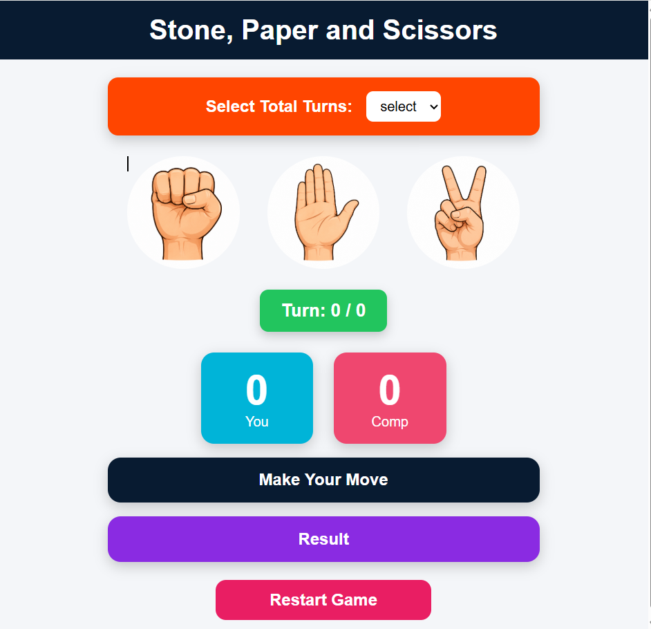
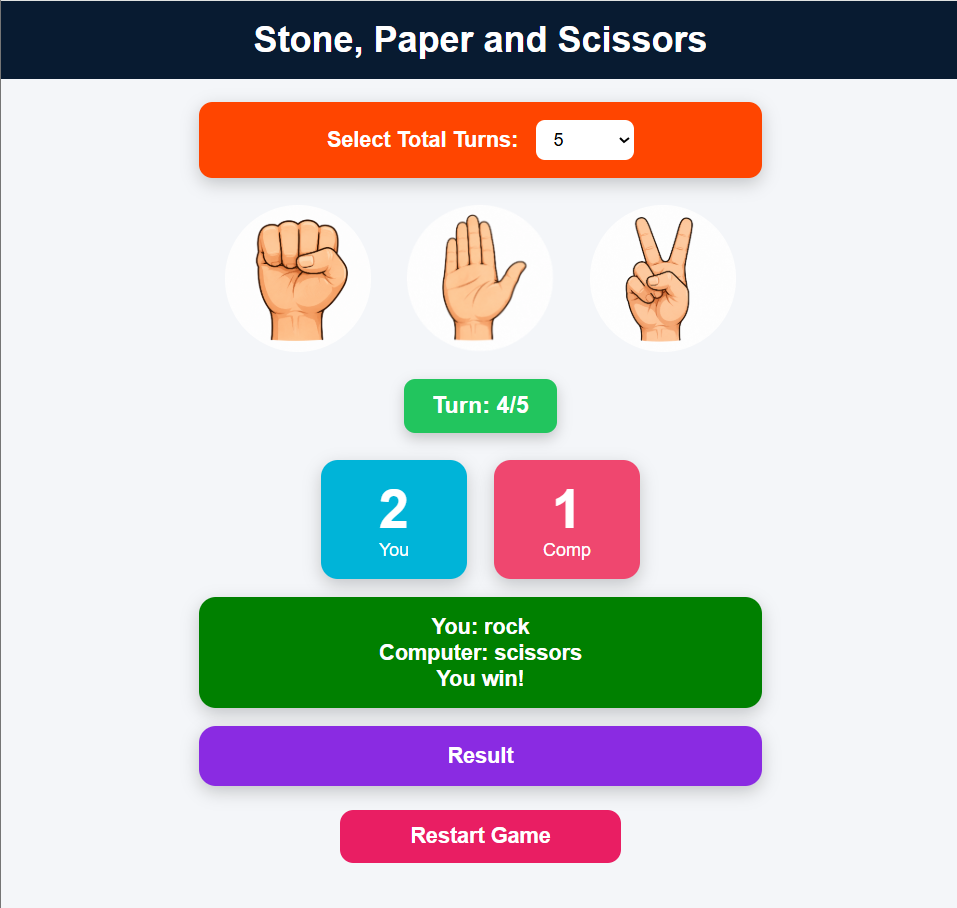
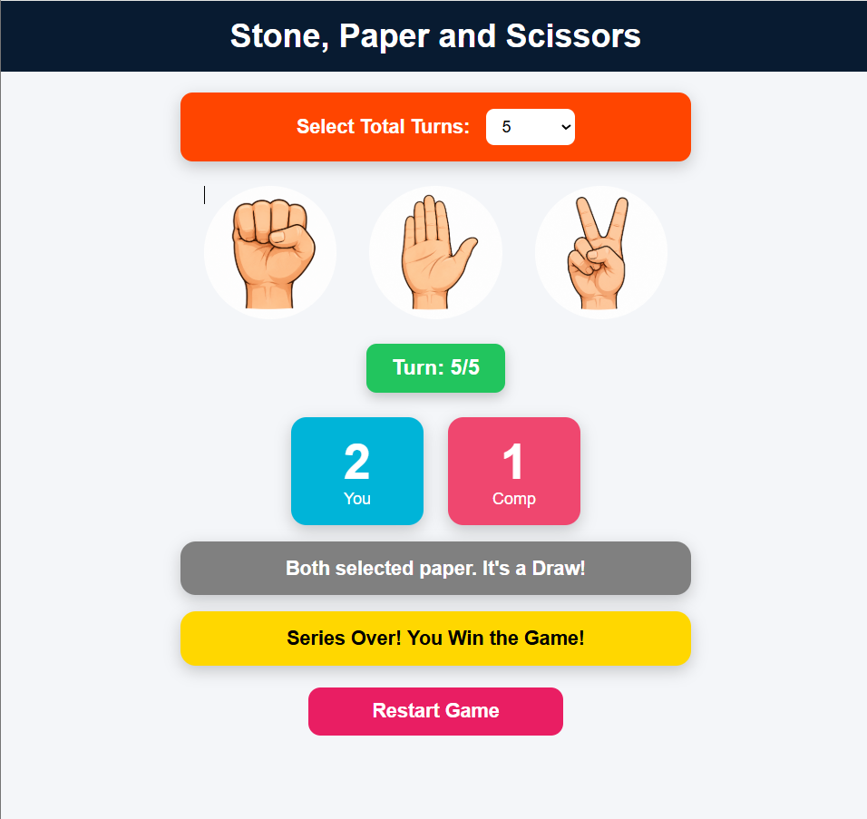

# 🪨✋✂️ js-rock-paper-scissors
A fully functional browser game implementing DOM manipulation,event listeners,state management,and media query  responsive design.

---

## 🌐 Live Demo

**Play the game:** https://js-rock-paper-scissors-sigma.vercel.app/

---

## 📌 Overview

This project recreates the classic Rock Paper Scissors game with a clean and responsive interface. Players can choose the number of rounds before starting, play against a computer opponent with randomly generated moves, and view real-time scores until the final winner is determined.

---

## ✨ Features

- Classic Rock, Paper, Scissors gameplay
- Configurable game length (5, 10, or 15 rounds)
- Random computer move generation
- Real-time score tracking
- Current turn indicator
- Automatic winner declaration after the final round
- Dynamic result messages with visual feedback
- One-click game restart
- Responsive layout for desktop, tablet, and mobile devices

---

## 🛠️ Tech Stack

- **HTML5**
- **CSS3**
- **JavaScript (ES6)**

---

## 📂 Project Structure

```text
js-Project1/
│
├── index.html
├── style.css
├── app.js
├── README.md
│
└── images/
    ├── rock.png
    ├── paper.png
    └── scissors.png
```

---

## 🚀 Getting Started

### Clone the repository

```bash
git clone https://github.com/BabulKumar100/js-rock-paper-scissors.git
```

### Navigate to the project directory

```bash
cd js-Project1
```

### Run the project

Open `index.html` in your preferred web browser.

No additional dependencies or installation steps are required.

---

## 🎮 Gameplay

1. Select the total number of rounds.
2. Choose Rock, Paper, or Scissors.
3. The computer makes a random selection.
4. Scores are updated after each round.
5. The current round number is displayed throughout the game.
6. Once all rounds are completed, the overall winner is announced.
7. Click **Restart Game** to start a new match.

---

## 📚 Concepts Demonstrated

This project applies several fundamental front-end development concepts, including:

- DOM Manipulation
- Event Handling
- State Management
- Conditional Logic
- JavaScript Functions
- Random Number Generation
- Template Literals
- CSS Flexbox
- Hover Effects and Transitions
- Responsive Design with Media Queries

---

## 📱 Responsive Design

The interface is optimized for different screen sizes, including:

- Desktop
- Laptop
- Tablet
- Mobile

---

## 📸 Screenshots

### Home Screen



### Gameplay



### Final Result



---

## 🔮 Future Enhancements

Some planned improvements include:

- Sound effects
- Background music
- Dark mode
- Two-player mode
- Difficulty levels
- Game statistics
- Local Storage for score history
- Improved animations
- Countdown timer for each round

---

## 🤝 Contributing

Contributions are welcome.

If you would like to improve the project:

1. Fork the repository.
2. Create a new feature branch.

```bash
git checkout -b feature-name
```

3. Commit your changes.

```bash
git commit -m "Add feature"
```

4. Push the branch.

```bash
git push origin feature-name
```

5. Open a Pull Request.

---

## 👨‍💻 Author

**Babul Kumar**

- GitHub: https://github.com/BabulKumar100
- LinkedIn: https://linkedin.com/in/babulkumar100

---

## ⭐ Support

If you found this project useful or interesting, consider giving it a **⭐ Star** on GitHub. Your support is appreciated and helps motivate future projects.

---

## 📄 License

This project is released under the **MIT License**.

You are free to use, modify, and distribute it for educational and personal purposes.


